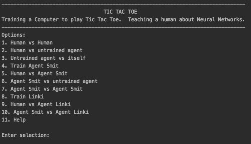
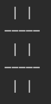
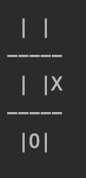
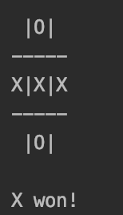
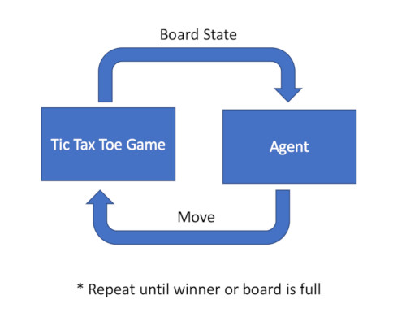
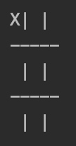
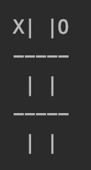
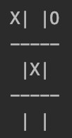

# KK Tic Tac Toe

A basic implementation of a neural network(NN) to play Tic Tac Toe.   
The main reason for this implementation, is not to build the fastest and best Agent to play human level Tic Tac Toe, but rather to provide an easy learning experience to anyone new to NN. 

Menu:

- Options 1, 2, 3, 6, 7, 9 and 10 are options to generate training data, by different Agents.
- Option 4 trains Agent Smit and option 8 is to train Agent Linki.

## The basics of the game
The game board is show as as follows (a blank board):

The spaces are numbered:

1 2 3

4 5 6

7 8 9

for example 'X' played in position 6 and 'O' in position 8:

The Game determines if the game is tied or if there is a winner:

## The Neural Network

The idea is to learn is a very easy example how a Neural Network works and also how this can be used to play a simple game like Tic Tac Toe.

### Board State
The Game presents the Agent with the 'board state' and then the Agent based on the 'board state' returns a 'move'.

 

The board state is the input (X) into the Neural Network and the Move is the output (y).  

In order to present the board state as compatible for an input into a Neural Network, the board state is taken and converted into features:

(9x2), where 9 is the spaces and 2 is either 'X' or 'O'.  The first 9 digits are for 'X' abd the second for 'O'. 

Some examples:
1. A board with space 1 as 'X'.

     

    1 0 0 0 0 0 0 0 0 0 0 0 0 0 0 0 0 0 

2. A board with space 1 as 'X' and space 3 as 'O'.

     

    1 0 0 0 0 0 0 0 0 0 0 1 0 0 0 0 0 0 
    
3. A board with space 1 as 'X', space 3 as 'O' and space 5 as 'X'.

     
    
    1 0 0 0 1 0 0 0 0 0 0 1 0 0 0 0 0 0
    
4. A board with space 1 as 'X', space 3 as 'O' and space 5 as 'X'.

     

    1 0 0 0 1 0 0 0 0 0 0 1 0 0 0 0 0 0 

### Play

